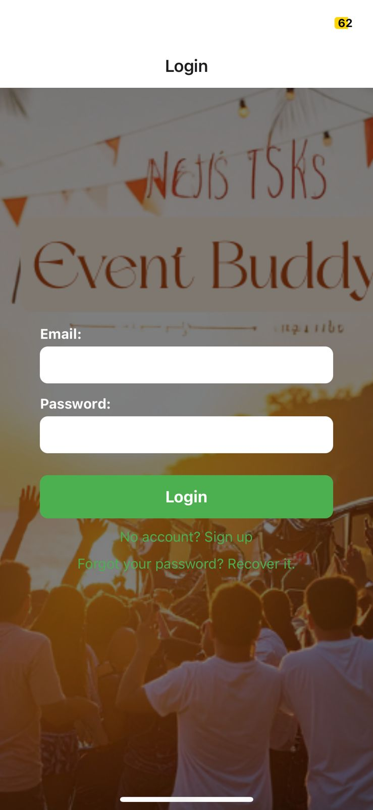
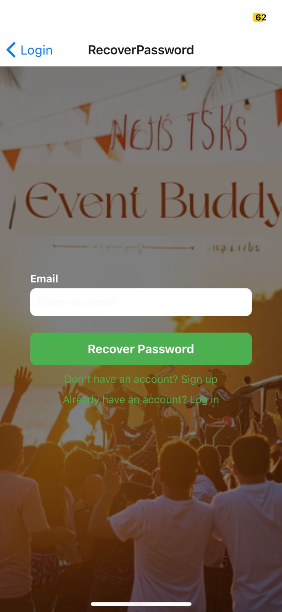

# 📱 Event Buddy

**Event Buddy** is a modern mobile application built with **React Native** and **Expo**, designed to help users discover, explore, and manage events effortlessly.

It features secure authentication using Firebase, allowing users to sign up, log in, recover passwords, and manage their profiles. Users can browse upcoming events, view detailed information, mark favorites, and confirm participation.

---

## 🚀 Features

- 🔐 Firebase Authentication (sign up, login, password recovery)
- 🗓️ Event listing with date and time
- ⭐ Add/remove favorite events
- ✅ Join or leave event participation
- 📍 View event location via Google Maps
- 👤 Edit profile (name and birthdate)
- 💚 Clean, responsive user interface

---

## 📦 Requirements

- Node.js (v14 or higher)
- npm or yarn
- Expo CLI (`npm install -g expo-cli`)
- Firebase account with Firestore and Authentication enabled

---

## 🔧 Installation

1. Clone the repository:

```bash
git clone https://github.com/monica-evelin/EventBuddy.git
cd EventBuddy

2. Install dependencies:
npm install
# or
yarn install

3. Create a firebaseConfig.js file in the root directory:
// firebaseConfig.js
export const firebaseConfig = {
  apiKey: "YOUR_API_KEY",
  authDomain: "YOUR_AUTH_DOMAIN",
  projectId: "YOUR_PROJECT_ID",
  storageBucket: "YOUR_STORAGE_BUCKET",
  messagingSenderId: "YOUR_SENDER_ID",
  appId: "YOUR_APP_ID"
};

4. Run the app:
expo start

🧱 Project Structure
.
├── assets/               # Icons and images
├── components/           # Reusable components (e.g., Background)
├── context/              # Authentication context
├── Navigators/           # Tab and stack navigators
├── screens/              # Main app screens
├── styles/               # Global styles
├── firebaseConfig.js     # Firebase configuration
├── App.js                # Main app file
├── README.md             # Project documentation
└── screenshots/          # Screenshots for the README

🧪 Completed Features

| Feature                         | Status |
| ------------------------------- | ------ |
| Firebase auth (login/signup)    | ✅      |
| Password recovery               | ✅      |
| Event listing + details         | ✅      |
| Join/cancel event participation | ✅      |
| Favorites system                | ✅      |
| Google Maps integration         | ✅      |
| Profile editing (name & DOB)    | ✅      |
| Profile picture upload          | ✅      |
| Responsive UI                   | ✅      |

📸 Screenshots

🔐 Login Screen


📝 Signup Screen


🗓️ Events List


📄 Event Details


⭐ Favorites


👤 Profile


🔁 Password Recovery


📫 Contact
Developed by Monica Oliveira
GitHub: @monica-evelin
Email: monica.evelin@hotmail.com
```
